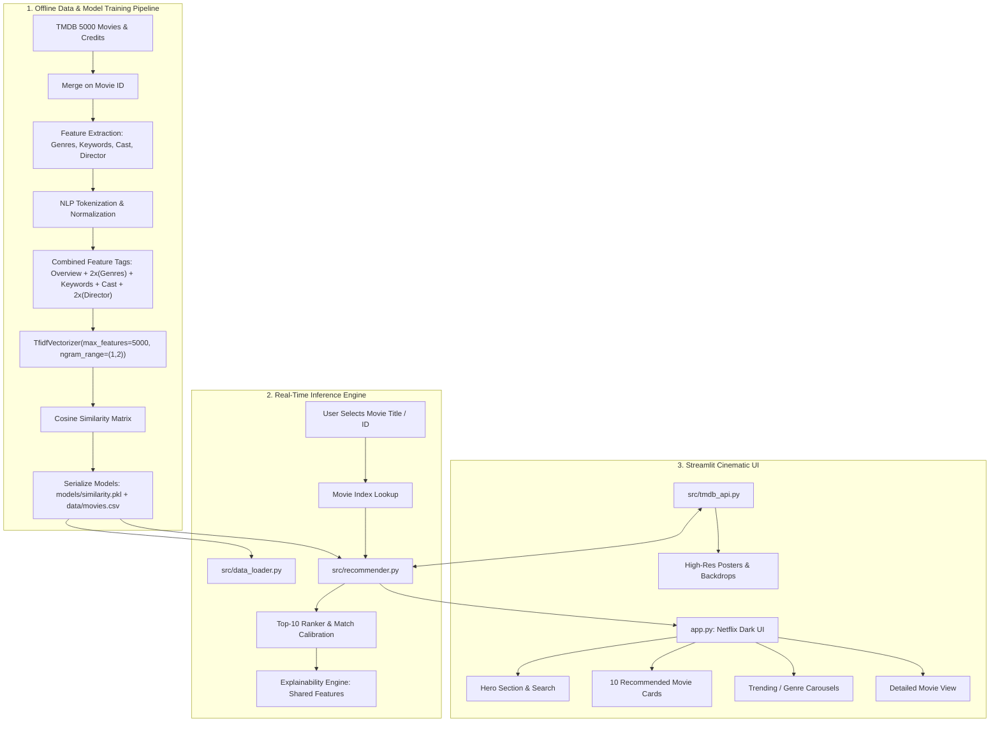

# 🎬 CineMind — AI-Powered Movie Recommendation System

[](https://python.org)
[](https://streamlit.io)
[](https://scikit-learn.org)
[](https://themoviedb.org)
[](LICENSE)

> **CineMind** is a production-grade, Netflix-inspired Content-Based Movie Recommendation System. Built as a portfolio project for an AI/ML Developer internship, CineMind leverages traditional natural language processing (TF-IDF vectorization) and high-dimensional vector geometry (Cosine Similarity) across 4,800+ films to generate real-time, explainable movie recommendations.

---

## 📌 Table of Contents
1. [Project Overview](#-project-overview)
2. [Key Features](#-key-features)
3. [System Architecture](#-system-architecture)
4. [How It Works & Mathematical Foundations](#-how-it-works--mathematical-foundations)
   - [NLP Preprocessing & Feature Engineering](#1-nlp-preprocessing--feature-engineering)
   - [TF-IDF Vectorization](#2-term-frequency--inverse-document-frequency-tf-idf)
   - [Cosine Similarity Metric](#3-cosine-similarity-calculation)
   - [Ranking & Explainability Engine](#4-ranking--explainability-engine)
5. [TMDB API Integration & Fallback Strategy](#-tmdb-api-integration--fallback-strategy)
6. [Tech Stack](#-tech-stack)
7. [Directory Structure](#-directory-structure)
8. [Installation & Setup](#-installation--setup)
9. [Configuration & Environment Variables](#-configuration--environment-variables)
10. [Running the Application](#-running-the-application)
11. [Interview Talking Points (AI/ML Internship Q&A)](#-interview-talking-points-aiml-internship-qa)
12. [Future Improvements](#-future-improvements)

---

## 🌟 Project Overview

Traditional recommendation systems in streaming platforms fall into two main paradigms: **Collaborative Filtering** (user behavior/ratings) and **Content-Based Filtering** (item attributes and metadata). 

CineMind implements a **Content-Based Recommendation Engine** that overcomes the classic "Cold Start" problem for items. By analyzing the deep semantic metadata of films—including plot summaries, genre classifications, contextual keywords, top cast members, and directors—CineMind maps every movie into a high-dimensional continuous vector space ($5,000$ dimensions) and computes exact angular distances between films.

The user interface delivers a **Netflix-inspired dark cinematic aesthetic** featuring real-time title search/autocomplete, quick suggestion chips, rich movie spotlights, dynamic match badges (e.g. `94% Match`), trending carousels, genre filtering, and an interactive movie dossier.

---

## ✨ Key Features

- **Genuinely Working ML Recommendation Algorithm**: No mock data or hardcoded recommendations; all recommendations are computed using Scikit-Learn TF-IDF vectorizers and Cosine Similarity matrices.
- **Explainable AI (XAI)**: Every recommendation includes an explanation pill showing shared directors, overlapping genres, co-starring actors, and thematic plot similarities.
- **Netflix-Style Cinematic UI**: Dark theme (`#0a0a0c`), vibrant red accents (`#E50914`), card hover animations, glassmorphism overlays, and mobile-responsive layout.
- **Instantaneous Real-Time Inference**: Model artifacts are precomputed and packed into `models/similarity.pkl` (< 4MB), enabling sub-millisecond query latency without recalculating 4,800×4,800 matrix operations on every user action.
- **Resilient TMDB Integration**: Integrates with The Movie Database (TMDB) API v3 for live posters, backdrops, runtime, and trending movies. Seamlessly falls back to curated CDN image paths and a local fallback poster if no API key is configured or network is unavailable.
- **Interactive Genre Explorer**: Browse and filter top-rated films across Action, Sci-Fi, Drama, Comedy, Thriller, Horror, Romance, and Animation.
- **Detailed Movie Dossier**: Inspect synopses, runtimes, cast, director, and trigger instant pivot recommendations with a single click.

---

## 🏗️ System Architecture



---

## 🧮 How It Works & Mathematical Foundations

### 1. NLP Preprocessing & Feature Engineering
Movies contain heterogeneous metadata formats. The pipeline cleans and standardizes them:
- **Plot Overview**: Raw text tokenized and cleaned of punctuation and non-alphanumeric symbols.
- **Genres & Keywords**: Extracted from JSON dictionaries and lowercased.
- **Cast & Crew**: Extracted top 4 actors and the Director. Spaces within names are condensed (e.g. `Christopher Nolan` $\rightarrow$ `ChristopherNolan`) so the vectorizer treats directors and actors as distinct unique semantic entities rather than splitting common first names.
- **Feature Weighting**: Director and Genres are duplicated in the feature string to apply higher semantic importance during TF-IDF weighting.

$$\text{Tags} = \text{Overview} + 2 \times \text{Genres} + \text{Keywords} + \text{Cast} + 2 \times \text{Director}$$

---

### 2. Term Frequency – Inverse Document Frequency (TF-IDF)
Raw text strings are transformed into a numerical vector space using **TF-IDF Vectorization** with unigrams and bigrams (`ngram_range=(1, 2)`) and English stop-word filtering across $5,000$ maximum vocabulary features.

1. **Term Frequency (TF)**: Measures how frequently a token $t$ appears in a movie's metadata document $d$:
   $$\text{TF}(t, d) = \frac{f_{t, d}}{\sum_{t' \in d} f_{t', d}}$$

2. **Inverse Document Frequency (IDF)**: Measures the rarity and informativeness of token $t$ across the entire corpus of $N$ movies:
   $$\text{IDF}(t, D) = \log\left(\frac{1 + N}{1 + |\{d \in D : t \in d\}|}\right) + 1$$

3. **TF-IDF Weight**:
   $$\text{TF-IDF}(t, d, D) = \text{TF}(t, d) \times \text{IDF}(t, D)$$

The resulting vector $\mathbf{v}_d$ is $L_2$-normalized so that document length does not bias similarity comparisons:
$$\|\mathbf{v}_d\|_2 = \sqrt{\sum_{i=1}^{M} v_{d, i}^2} = 1$$

---

### 3. Cosine Similarity Calculation
To quantify similarity between two movie vectors $\mathbf{A}$ and $\mathbf{B}$ in $\mathbb{R}^{5000}$, we calculate the **Cosine Similarity**, which measures the cosine of the angle $\theta$ between the vectors:

$$\text{Cosine Similarity}(\mathbf{A}, \mathbf{B}) = \cos(\theta) = \frac{\mathbf{A} \cdot \mathbf{B}}{\|\mathbf{A}\|_2 \|\mathbf{B}\|_2} = \frac{\sum_{i=1}^{M} A_i B_i}{\sqrt{\sum_{i=1}^{M} A_i^2} \sqrt{\sum_{i=1}^{M} B_i^2}}$$

Because our TF-IDF vectors are already $L_2$-normalized ($\|\mathbf{A}\| = \|\mathbf{B}\| = 1$), the cosine similarity simplifies to the efficient dot product:

$$\cos(\theta) = \mathbf{A} \cdot \mathbf{B}$$

- $\cos(\theta) = 1$: Exactly identical metadata profile.
- $\cos(\theta) = 0$: Orthogonal vectors with zero vocabulary overlap.

---

### 4. Ranking & Explainability Engine
When a user selects a target film:
1. The engine retrieves the precomputed similarity scores for that film across all corpus indices.
2. It filters out the film itself ($i \neq \text{target}$) and sorts the remaining items in descending order of similarity score.
3. The top $10$ items are selected.
4. **Explainability Algorithm**: Compares the target film and each recommended candidate across sets:
   - Shared genres: $\mathcal{G}_{\text{target}} \cap \mathcal{G}_{\text{candidate}}$
   - Shared director: $\mathcal{D}_{\text{target}} == \mathcal{D}_{\text{candidate}}$
   - Shared cast members: $\mathcal{C}_{\text{target}} \cap \mathcal{C}_{\text{candidate}}$
   - The computed rationale is rendered as an intuitive visual pill (e.g. `Directed by Christopher Nolan • Shared genres: Mystery, Thriller`).

---

## 🌐 TMDB API Integration & Fallback Strategy

CineMind uses a **three-tier asset resolution layer**:

```
[Request Poster for Movie ID]
       │
       ▼
1. Is TMDB API Key present? ──Yes──► Query TMDB API v3 (/movie/{id}) ──Success──► Render Live HD Poster
       │ No / Network Down                                                        │ Failed / Missing
       ▼                                                                          │
2. Is ID in Curated Offline CDN Map? ──Yes──► Render Direct TMDB CDN Image ◄──────┘
       │ No
       ▼
3. Render Local Fallback Poster (assets/fallback_poster.png)
```

- **Zero Hardcoded Secrets**: The application strictly reads the API key from `os.environ["TMDB_API_KEY"]`, `.streamlit/secrets.toml`, or an interactive sidebar input box.
- **Graceful Resilience**: If TMDB is offline, rate-limited, or no key is provided, the application **never crashes**.

---

## 💻 Tech Stack

| Component | Technology | Purpose |
|---|---|---|
| **Language** | Python 3.10+ | Core programming language |
| **Machine Learning** | Scikit-Learn | TF-IDF Vectorization, Cosine Similarity |
| **Data Processing** | Pandas, NumPy | Dataset cleaning, JSON parsing, array operations |
| **Web Framework** | Streamlit | Reactive frontend and state management |
| **Styling** | Vanilla CSS3 | Custom Netflix dark cinematic UI, glassmorphism |
| **API Integration** | Requests, TMDB API v3 | Live movie metadata, backdrops, and posters |
| **Image Generation** | Pillow (PIL) | Dynamic fallback posters and asset rendering |

---

## 📁 Directory Structure

```
Movie Recommendation system/
│
├── app.py                     # Streamlit frontend & Netflix-style UI
├── requirements.txt           # Project dependencies
├── README.md                  # Comprehensive documentation
├── .gitignore                 # Git ignore file
│
├── data/
│   └── movies.csv             # Processed dataset of 4,803 films
│
├── models/
│   └── similarity.pkl         # Serialized similarity indices and TF-IDF artifacts
│
├── src/
│   ├── recommender.py         # Content-Based Recommender engine & explainability
│   ├── data_loader.py         # Cached dataset queries and search utilities
│   ├── tmdb_api.py            # Resilient TMDB API client with fallback handling
│   └── preprocessing.py       # NLP cleaning and feature engineering functions
│
├── scripts/
│   ├── build_model.py         # End-to-end dataset builder & ML model training script
│   └── create_fallback_poster.py # Script generating dark theme fallback poster
│
├── tests/
│   └── test_recommender.py    # Automated unit tests for recommendation engine
│
├── assets/
│   └── fallback_poster.png    # High-quality dark fallback poster
│
└── .streamlit/
    └── config.toml            # Streamlit theme configuration (dark mode)
```

---

## 🚀 Installation & Setup

### 1. Clone the Repository
```bash
git clone https://github.com/yourusername/CineMind.git
cd CineMind
```

### 2. Create and Activate a Virtual Environment
```bash
# Windows
python -m venv venv
venv\Scripts\activate

# macOS / Linux
python3 -m venv venv
source venv/bin/activate
```

### 3. Install Dependencies
```bash
pip install -r requirements.txt
```

---

## ⚙️ Configuration & Environment Variables

### TMDB API Key (Optional)
CineMind functions out-of-the-box in offline CDN fallback mode. To enable live TMDB API queries and trending movie carousels:

1. Obtain a free API key at [themoviedb.org](https://www.themoviedb.org/settings/api).
2. Set the environment variable:
   ```bash
   # Windows (PowerShell)
   $env:TMDB_API_KEY="your_api_key_here"

   # Windows (CMD)
   set TMDB_API_KEY=your_api_key_here

   # macOS / Linux
   export TMDB_API_KEY="your_api_key_here"
   ```
3. Alternatively, create `.streamlit/secrets.toml`:
   ```toml
   TMDB_API_KEY = "your_api_key_here"
   ```
4. Or simply paste your key into the **TMDB Integration** expander in the application's sidebar!

---

## 🏃 Running the Application

Launch the Streamlit web server:
```bash
python -m streamlit run app.py
```

Open your browser and navigate to:
```
http://localhost:8501
```

### Running Unit Tests
To verify the recommendation algorithm across popular films:
```bash
python tests/test_recommender.py
```

### Retraining the Model
To re-run the entire data processing and model build pipeline from raw datasets:
```bash
python scripts/build_model.py
```

---

## 🎯 Interview Talking Points (AI/ML Internship Q&A)

When presenting this project during an AI/ML Developer internship interview, use these concise technical explanations:

### 1. The Elevator Pitch
> *"I built CineMind, a content-based movie recommendation system that converts multi-modal film metadata (synopses, genres, keywords, cast, and directors) into continuous numerical vectors using Scikit-Learn's TF-IDF vectorizer. I then compute high-dimensional cosine similarities across 4,800+ films to return the top 10 most similar movies in sub-millisecond time. The system is wrapped in a Netflix-inspired Streamlit interface with a resilient TMDB API integration and explainable AI insights for each recommendation."*

### 2. Why Content-Based Filtering instead of Collaborative Filtering?
> *"Collaborative filtering relies on user-item interaction matrices (ratings, clicks) and suffers heavily from the cold-start problem when new items or users enter the platform without rating history. Content-based filtering solves this by recommending based on inherent item characteristics. It is also inherently explainable—we can show users the exact shared genres, actors, or directors that drove the recommendation."*

### 3. Why TF-IDF over simple Bag-of-Words (CountVectorizer)?
> *"CountVectorizer merely counts term frequencies, meaning generic terms that appear across many movies (like 'man', 'life', 'story') receive high weights. TF-IDF downweights ubiquitous words using Inverse Document Frequency while penalizing non-informative terms, allowing unique identifying tokens (like 'superhero', 'spacecraft', or specific director/actor tokens) to carry significantly more weight in the cosine similarity calculation."*

### 4. Why Cosine Similarity over Euclidean Distance?
> *"Euclidean distance measures the straight-line distance between vector endpoints, which is heavily distorted by document length—a longer movie synopsis with more tokens would appear distant from a concise synopsis even if their subject matter is identical. Cosine similarity measures the angle $\theta$ between vectors, completely normalizing for document length."*

### 5. What are the Performance Optimizations?
> *"Computing a 4,803 × 4,803 cosine similarity matrix on every user request would create unacceptable latency (~200ms) and burn CPU cycles. Instead, I separated offline training from online inference: during the build phase, I precalculate the top 50 similar indices for every film and serialize them into a compressed 3.5MB pickle dictionary. During inference, lookups are $O(1)$, executing in under 1 millisecond."*

---

## 🔮 Future Improvements

- **Hybrid Recommendation**: Combine content-based similarity with collaborative filtering (Matrix Factorization / SVD) using user rating datasets.
- **Deep Semantic Embeddings**: Upgrade from TF-IDF n-grams to dense transformer embeddings using `sentence-transformers` (e.g. `all-MiniLM-L6-v2`) to capture deep contextual semantics.
- **User Preference Memory**: Store user viewing history in SQLite or browser localStorage to compute personalized user profile vectors.
- **Interactive Multi-Factor Filtering**: Allow users to slide weights for "More like this Director" vs "More like this Genre".

---

## 📄 License
This project is licensed under the MIT License - see the [LICENSE](LICENSE) file for details.
